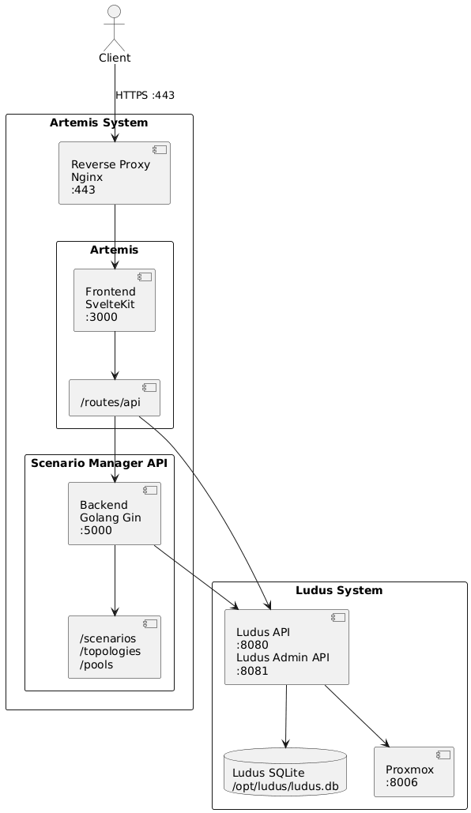

# Artemis Frontend Overview

## System Architecture

The Artemis system consists of multiple interconnected components distributed across Docker containers and the host system. The architecture is designed to provide a web-based interface for managing Ludus cybersecurity training ranges through an intuitive frontend application.



## Further Resources

- [Artemis FE Guide](./docs/admin-guide.md)
- [Game Developer Guide](./docs/user-guide.md)
- [Deploy Artemis + Ludus Guide](./docs/deploy.md)
- [Artemis FE Components Explained](./docs/components.md)

## Developing

Once you install dependencies with `npm install` you can start a development server:

```bash
npm run dev
```