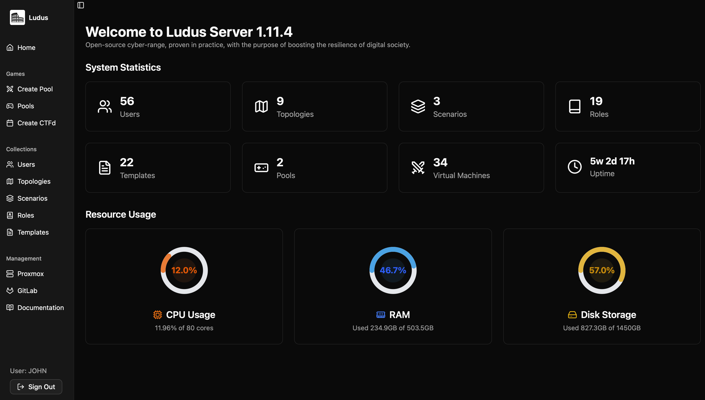

# Artemis Frontend Overview

The Artemis system consists of multiple interconnected components. The architecture is designed to provide a web-based interface for managing Ludus cybersecurity training ranges through an intuitive frontend application. Read more about its' components here - [Artemis Components Explained](./docs/components.md). 




## Developing

```bash
cp .env.example .env
```

Add `trustedOrigins` to `svelte.config.js`
```
'http://localhost:5173', 'http://localhost:3000'
```

Edit environment variables:

```bash
cp .env.example .env
# remove
HOST=127.0.0.1
PORT=3000
BODY_SIZE_LIMIT=8589934592
# change
https://127.0.0.1:5000
PUBLIC_DULUS_SERVER=
```

```bash
npm install
npm run dev
```

## Test Deployment

Generate `PRIVATE_JWT_SECRET` and `PRIVATE_ENCRYPTION_SECRET` using:

```bash
openssl rand -hex 32
```

```bash
npm install
npm run build
npm start
```