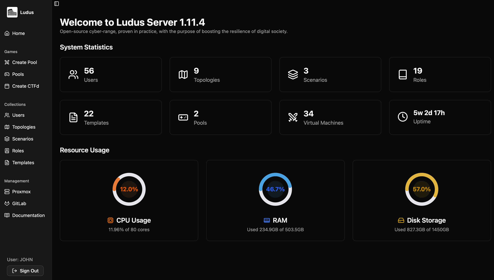

# Artemis Frontend

> **A SvelteKit-based web interface for managing Ludus cybersecurity training ranges**



## Documentation

- **[System Architecture & Components](./docs/components.md)** - Learn about the system architecture, component interactions, and authentication flow
- **[Codebase Structure & Guide](./docs/structure.md)** - Comprehensive guide to the repository structure, file organization, and core directories
- **[Admin Guide](./docs/artemis-admin-guide.md)** - Learn how to interact with the web UI effectively.
- **[CTFd Guide](https://gitlab.kypo.fiit.stuba.sk/stu-fiit-ludus/knowledge-base/-/tree/main/03-ctfd-guide/web-deploy?ref_type=heads)** - Instructions for creating a CTFd development instance or deploying an actual game.

## Overview

The Artemis system consists of multiple interconnected components. The architecture is designed to provide a web-based interface for managing Ludus cybersecurity training ranges through an intuitive frontend application.

## Quick Start

### Development

```bash
cp .env.example .env
```

Add `trustedOrigins` to `svelte.config.js`
```
'http://localhost:5173', 'http://localhost:3000'
```

Edit environment variables:

```bash
cp .env.example .env
# remove
HOST=127.0.0.1
PORT=3000
BODY_SIZE_LIMIT=8589934592
# change
PUBLIC_DULUS_SERVER=https://127.0.0.1:5000
```

```bash
npm install
npm run dev
```

## Test Deployment

Generate `PRIVATE_JWT_SECRET` and `PRIVATE_ENCRYPTION_SECRET` using:

```bash
openssl rand -hex 32
```

```bash
npm install
npm run build
npm start
```