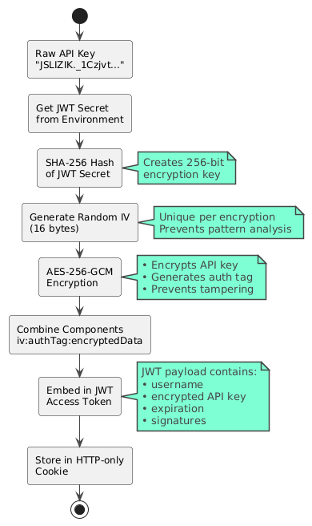

# Authentication

The Artemis frontend uses a JWT-based authentication system that validates users against the Ludus API. Users authenticate with their Ludus API key, which gets encrypted and stored in a JWT token as an HTTP-only cookie.


## Key Security Features

1. **HTTP-only Cookies**: Prevents XSS attacks by making tokens inaccessible to JavaScript
2. **API Key Encryption**: API keys are encrypted with AES-256-GCM before storage in JWT
3. **Server-side Validation**: All authentication checks happen server-side
4. **Secure Cookie Options**: SameSite=strict, secure flags for production
5. **Token Expiry**: 12-hour token expiration with automatic cleanup
6. **Stateless Design**: No server-side session storage required

## Token Structure

```typescript
interface AuthTokenPayload {
    username: string;           // Extracted from API key
    apiKey: string;            // Encrypted Ludus API key
    iat: number;               // Issued at
    exp: number;               // Expires at
    iss: 'artemis-frontend';   // Issuer
    aud: 'artemis-users';      // Audience
}
```

## Encryption Details

- **Algorithm**: AES-256-GCM
- **Key Derivation**: SHA-256 hash of ENCRYPTION_SECRET
- **Format**: `iv:authTag:encryptedData` (all hex-encoded)
- **Security**: Each encryption uses a random IV for semantic security



## Authentication Endpoints

| Endpoint | Method | Purpose |
|----------|--------|---------|
| `/api/auth/login` | POST | Authenticate with API key |
| `/api/auth/logout` | POST | Clear authentication cookies |
| `/api/auth/validate` | GET | Check authentication status |