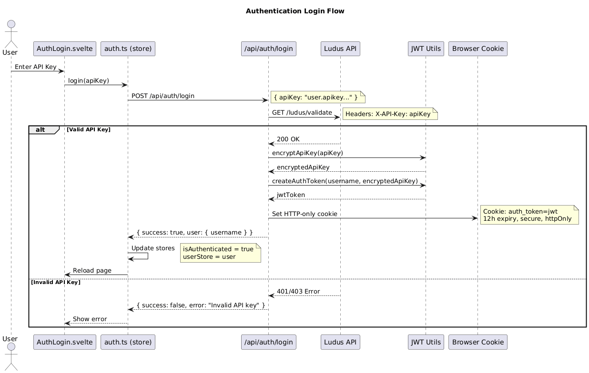

## Components

### Client Layer
Users interact with the system through a web browser, accessing the application via HTTPS on port 443.

### Docker Network

**Nginx (:443)**
- Acts as a reverse proxy and SSL/TLS termination point
- Implements comprehensive security features:
  - Rate limiting with configurable zones (30-50 requests/second)
  - Connection limits to prevent resource exhaustion
  - Security headers (X-Frame-Options, CSP, XSS Protection)
  - TLS 1.2/1.3 with strong cipher suites
  - Bot and suspicious user-agent blocking
  - Buffer overflow protection
  - HTTP to HTTPS redirect

**Artemis Frontend Container**
- SvelteKit-based web application providing the user interface
- Contains `/routes/api` endpoints for backend communication
- Communicates with both Dulus (internally) and Ludus/Proxmox (externally)
- Handles authentication via JWT tokens

**Scenario Manager API Container (Dulus)**
- Golang Gin based API service running on port 5000
- Manages proxmox statistics as well as scenarios, topologies, and pool configurations
- Stores data in `/scenarios`, `/topologies`, and `/pools` directories
- Has read-only access to Ludus SQLite database
- Communicates with both Ludus API and Proxmox

### Host System (172.17.0.1)

**Ludus (:8080, :8081)**
- Core range management system running on the host
- Port 8080: Standard user API
- Port 8081: Admin API
- Manages the Ludus SQLite database
- Orchestrates VM deployments through Proxmox

**Ludus SQLite Database**
- Central database containing range and user information
- Shared between Ludus (read/write) and Dulus (read-only)

**Proxmox (:8006)**
- Virtualization platform hosting all VMs

## Authentication in depth

The Artemis frontend uses a JWT-based authentication system that validates users against the Ludus API. Users authenticate with their Ludus API key, which gets encrypted and stored in a JWT token as an HTTP-only cookie.



#### Key Security Features

1. **HTTP-only Cookies**: Prevents XSS attacks by making tokens inaccessible to JavaScript
2. **API Key Encryption**: API keys are encrypted with AES-256-GCM before storage in JWT
3. **Server-side Validation**: All authentication checks happen server-side
4. **Secure Cookie Options**: SameSite=strict, secure flags for production
5. **Token Expiry**: 12-hour token expiration with automatic cleanup
6. **Stateless Design**: No server-side session storage required

#### Token Structure

```typescript
interface AuthTokenPayload {
    username: string;           // Extracted from API key
    apiKey: string;            // Encrypted Ludus API key
    iat: number;               // Issued at
    exp: number;               // Expires at
    iss: 'artemis-frontend';   // Issuer
    aud: 'artemis-users';      // Audience
}
```

#### Encryption Details

- **Algorithm**: AES-256-GCM
- **Key Derivation**: SHA-256 hash of ENCRYPTION_SECRET
- **Format**: `iv:authTag:encryptedData` (all hex-encoded)
- **Security**: Each encryption uses a random IV for semantic security


#### Authentication Endpoints

| Endpoint | Method | Purpose |
|----------|--------|---------|
| `/api/auth/login` | POST | Authenticate with API key |
| `/api/auth/logout` | POST | Clear authentication cookies |
| `/api/auth/validate` | GET | Check authentication status |